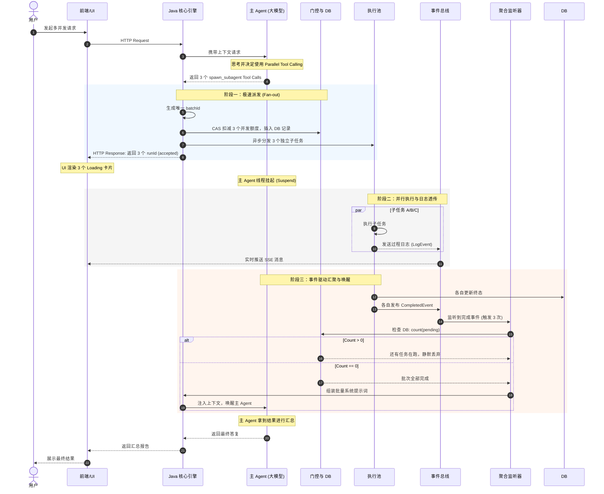

# Subagent Map-Reduce 异步并发架构设计

> **版本**: v1.4  
> **状态**: 设计草案  
> **最后更新**: 2026-04-10  
> **作者**: 孙峥

---

## 目录

1. [概述](#1-概述)
2. [当前实现程度](#2-当前实现程度)
3. [目标架构](#3-目标架构)
4. [核心组件设计](#4-核心组件设计)
5. [数据模型变更](#5-数据模型变更)
6. [API 设计](#6-api-设计)
7. [实现差距与风险](#7-实现差距与风险)
8. [分阶段实施计划](#8-分阶段实施计划)
9. [测试策略](#9-测试策略)
10. [生产级加固与非理想路径](#10-生产级加固与非理想路径)
11. [参考资料](#11-参考资料)

---

## 1. 概述

### 1.1 设计目标

构建一个**生产级的 Subagent 异步并发系统**，支持：

1. **Map-Reduce 模式**: 主 Agent 可派发多个独立子任务并行执行
2. **实时进度透传**: 子 Agent 执行日志实时推送到前端，缓解用户等待焦虑
3. **事件驱动汇聚**: 批次任务全部完成后自动唤醒主 Agent 进行结果汇总
4. **上下文隔离**: 每个子 Agent 拥有独立的执行上下文和工具权限

### 1.2 核心场景

| 场景 | 描述 | 并发生效 |
|------|------|----------|
| 多文件处理 | "分析这 10 个代码文件" | ✅ 10 个子 Agent 并行 |
| 多语言翻译 | "翻译成英语、日语、法语、德语" | ✅ 4 个子 Agent 并行 |
| 多区域报告 | "生成 12 个销售区域的月报" | ✅ 12 个子 Agent 并行 |
| 顺序任务 | "读取文件 A，然后编辑文件 B" | ❌ 顺序执行 |
| 单功能开发 | "添加用户登录功能" | ❌ 无需 spawn |

### 1.3 关键指标

| 指标 | 目标值 | 说明 |
|------|--------|------|
| 并发上限 | 10 个子 Agent/会话 | 防止资源耗尽 |
| 深度上限 | 5 层嵌套 | 防止无限派生 |
| 超时时间 | 10 分钟/子任务 | 防止长时间占用 |
| 派发延迟 | < 100ms/子任务 | 快速启动 |
| 完成检测延迟 | < 1s | 及时唤醒主 Agent |

---

## 2. 当前实现程度

### 2.1 已实现功能 ✅

| 功能 | 状态 | 实现位置 |
|------|------|----------|
| spawn 立即返回 runId | ✅ 完成 | `MultiAgentFacade.spawnTask()` |
| 并发槽位控制 (CAS) | ✅ 完成 | `SpawnGatekeeper.checkAndAcquire()` |
| 深度限制检查 | ✅ 完成 | `SpawnGatekeeper` |
| 工具白名单检查 | ✅ 完成 | `SpawnGatekeeper` |
| DB 持久化运行记录 | ✅ 完成 | `SubagentRunService` |
| 运维 API | ✅ 完成 | `OpsSubagentController` (7 个接口) |
| Shadow 模式评估 | ✅ 完成 | `MultiAgentFacade` |
| Worker 嵌套 spawn 默认关闭、可配置开启 | ✅ 完成 | `demo.multi-agent.worker-expose-spawn-subagent` + `WorkerAgentExecutor`；`SpawnSubagentTool` 按当前 `subagent_run.depth` 传门控 |

### 2.2 缺失功能 ⚠️

| 功能 | 状态 | 优先级 |
|------|------|--------|
| batchId 批次关联 | ❌ 缺失 | P0 |
| 批次完成检测 | ❌ 缺失 | P0 |
| 主 Agent 自动唤醒 | ❌ 缺失 | P0 |
| SSE 日志推送 | ❌ 缺失 | P1 (依赖前端) |
| 批次派生 API | ❌ 缺失 | P1 |
| Redis 分布式 EventBus | ❌ 缺失 | P2 (分布式部署时需要) |

### 2.3 当前执行流程

```
用户请求
   ↓
主 Agent 思考 → 决定 spawn 子 Agent
   ↓
调用 spawn_subagent 工具
   ↓
MultiAgentFacade.spawnTask()
   ↓
SpawnGatekeeper.checkAndAcquire()  ← 并发/深度/白名单检查
   ↓
SubagentRunService.createRun()     ← DB 记录
   ↓
LocalSubAgentRuntime.spawn()       ← 异步执行
   ↓
立即返回 runId (不等待完成)         ← 主 Agent 挂起等待
   ↓
子 Agent 在独立线程执行
   ↓
完成后更新 DB 状态 (COMPLETED/FAILED)
   ↓
⚠️ 当前：无后续动作 (主 Agent 需要轮询或等待外部触发)
```

### 2.4 Worker 嵌套派生：`worker-expose-spawn-subagent`

| 项 | 说明 |
|----|------|
| **配置键** | `demo.multi-agent.worker-expose-spawn-subagent`（环境变量 `DEMO_MULTI_AGENT_WORKER_SPAWN`） |
| **默认值** | `false`：Worker 工具列表 **不包含** `spawn_subagent`，与「主会话 Fan-out、子会话只执行」的默认产品形态一致 |
| **置为 `true`** | Worker 可获得 `spawn_subagent`；仍受 `max-spawn-depth`、`max-concurrent-spawns` 约束 |
| **深度门控** | `SpawnSubagentTool` 在 Worker 线程内根据 `TraceContext.runId` 加载当前 `subagent_run`，将 **已有 depth** 作为 `SpawnGatekeeper.checkAndAcquire` 的 `currentDepth`，避免嵌套时始终按 0 深度绕过上限 |
| **可观测** | 运维摘要接口 `GET /api/ops/subagent/summary`（或等价）的 `multiAgent.workerExposeSpawnSubagent` 字段与配置对齐 |
| **提示词** | `AgentPrompts.WORKER_SUBAGENT_SYSTEM` 说明默认无 spawn、开启后的行为边界 |

**建议**：Map-Reduce 批量架构下，生产环境默认保持 `false`；仅在受控实验或专用租户开启 `true`。

---

## 3. 目标架构

### 3.1 全链路时序图



### 3.2 组件架构图

```
┌─────────────────────────────────────────────────────────────────────┐
│                          Frontend / UI                              │
│  ┌─────────────┐  ┌─────────────┐  ┌─────────────┐                 │
│  │ 任务卡片 A   │  │ 任务卡片 B   │  │ 任务卡片 C   │  ← SSE 实时日志  │
│  └─────────────┘  └─────────────┘  └─────────────┘                 │
└─────────────────────────────────────────────────────────────────────┘
                              ↕ HTTP / SSE
┌─────────────────────────────────────────────────────────────────────┐
│                       Java Core Engine                              │
│  ┌──────────────┐    ┌──────────────┐    ┌──────────────┐          │
│  │ Ops API      │    │ spawn API    │    │ SSE Endpoint │          │
│  │ Controller   │    │ Controller   │    │ (新增)       │          │
│  └───────┬──────┘    └───────┬──────┘    └───────┬──────┘          │
│          │                   │                   │                  │
│  ┌───────▼──────────────────▼───────────────────▼───────┐          │
│  │                   Event Bus                           │          │
│  │  (SpawnEvent / LogEvent / CompletedEvent)            │          │
│  └───────┬──────────────────┬───────────────────┬───────┘          │
│          │                   │                   │                  │
│  ┌───────▼──────┐  ┌─────────▼──────┐  ┌────────▼───────┐          │
│  │ Batch        │  │ MultiAgent     │  │ SubagentRun    │          │
│  │ Listener     │  │ Facade         │  │ Service        │          │
│  │ (新增)       │  │                │  │                │          │
│  └───────┬──────┘  └────────┬───────┘  └────────┬───────┘          │
│          │                   │                   │                  │
│  ┌───────▼──────────────────▼───────────────────▼───────┐          │
│  │                  Spawn Gatekeeper                     │          │
│  │  (depth / concurrent / allowlist / batch tracking)   │          │
│  └───────────────────────────┬───────────────────────────┘          │
│                              │                                      │
│  ┌───────────────────────────▼───────────────────────────┐          │
│  │                  subagent_run (H2/PostgreSQL)         │          │
│  │  runId | batchId | sessionId | status | result | ... │          │
│  └───────────────────────────────────────────────────────┘          │
└─────────────────────────────────────────────────────────────────────┘
                              ↕
┌─────────────────────────────────────────────────────────────────────┐
│                      Execution Pool                                 │
│  ┌─────────────┐  ┌─────────────┐  ┌─────────────┐                 │
│  │ Worker A    │  │ Worker B    │  │ Worker C    │                 │
│  │ (Thread)    │  │ (Thread)    │  │ (Thread)    │                 │
│  └─────────────┘  └─────────────┘  └─────────────┘                 │
└─────────────────────────────────────────────────────────────────────┘
```

---

## 4. 核心组件设计

### 4.1 BatchContext 批次上下文

```java
/**
 * 批次上下文：追踪一组相关子任务的执行状态
 */
public class BatchContext {
    private final String batchId;          // 批次唯一 ID
    private final String sessionId;        // 所属会话
    private final String mainRunId;        // 主 Agent 运行 ID（用于唤醒）
    private final int totalTasks;          // 批次总任务数
    private final AtomicInteger completed; // 已完成计数
    private final ConcurrentHashMap<String, String> taskResults; // 结果收集
    private final Instant createdAt;       // 创建时间
    private final Instant deadline;        // 截止时间（超时用）
    
    // 状态判断
    public boolean isAllCompleted() {
        return completed.get() >= totalTasks;
    }
    
    public String collectResultsAsSummary() {
        // 组装批次结果为汇总文本
    }
}
```

### 4.2 BatchCompletionListener 批次完成监听器

```java
/**
 * 批次完成监听器：监听子任务完成事件，检测批次是否全部完成
 */
@Component
public class BatchCompletionListener {
    
    private final ConcurrentHashMap<String, BatchContext> batchRegistry = new ConcurrentHashMap<>();
    private final SubagentRunService runService;
    private final EnhancedAgenticQueryLoop queryLoop; // 用于唤醒主 Agent
    
    /**
     * 注册新批次
     */
    public BatchContext createBatch(String sessionId, String mainRunId, int totalTasks) {
        String batchId = generateBatchId();
        BatchContext ctx = new BatchContext(batchId, sessionId, mainRunId, totalTasks);
        batchRegistry.put(batchId, ctx);
        return ctx;
    }
    
    /**
     * 子任务完成回调
     */
    @Async
    public void onSubagentCompleted(String runId, String sessionId, String result) {
        // 1. 查询运行记录获取 batchId
        SubagentRun run = runService.getRun(runId, sessionId);
        String batchId = run.getBatchId();
        
        if (batchId == null || batchId.isBlank()) {
            return; // 非批次任务，跳过
        }
        
        // 2. 更新批次进度
        BatchContext ctx = batchRegistry.get(batchId);
        if (ctx == null) {
            log.warn("Batch context not found: batchId={}", batchId);
            return;
        }
        
        ctx.markCompleted(runId, result);
        
        // 3. 检测是否全部完成
        if (ctx.isAllCompleted()) {
            log.info("Batch completed: batchId={}, total={}", batchId, ctx.getTotalTasks());
            
            // 4. 唤醒主 Agent
            resumeMainThread(ctx);
            
            // 5. 清理注册表
            batchRegistry.remove(batchId);
        }
    }
    
    /**
     * 唤醒主 Agent：注入批次结果作为系统消息
     */
    private void resumeMainThread(BatchContext ctx) {
        String summary = ctx.collectResultsAsSummary();
        
        // 方式 1: 通过 SSE 推送唤醒通知
        eventBus.publish(new AgentResumeEvent(
            ctx.getSessionId(),
            ctx.getMainRunId(),
            summary
        ));
        
        // 方式 2: 直接调用 queryLoop 恢复（需要解决线程同步）
        // queryLoop.resume(ctx.getSessionId(), summary);
    }
    
    /**
     * 超时清理：定期检查超时批次
     */
    @Scheduled(fixedRate = 60000) // 每分钟检查一次
    public void cleanupTimeoutBatches() {
        Instant now = Instant.now();
        batchRegistry.entrySet().removeIf(entry -> {
            if (now.isAfter(entry.getValue().getDeadline())) {
                log.warn("Batch timeout: batchId={}", entry.getKey());
                // 触发超时处理逻辑
                return true;
            }
            return false;
        });
    }
}
```

### 4.3 SSE Endpoint 实时推送端点

```java
/**
 * SSE 端点：实时推送子 Agent 执行进度
 */
@RestController
@RequestMapping("/api/stream")
public class SubagentStreamController {
    
    private final SseEmitterRegistry emitterRegistry = new SseEmitterRegistry();
    private final SubagentEventBus eventBus;
    
    /**
     * 建立 SSE 连接
     */
    @GetMapping(value = "/subagent/{sessionId}", produces = MediaType.TEXT_EVENT_STREAM_VALUE)
    public SseEmitter subscribe(@PathVariable String sessionId,
                                @RequestParam(required = false) String runId) {
        SseEmitter emitter = new SseEmitter(0L); // 永不过期
        
        emitterRegistry.register(sessionId, emitter);
        if (runId != null) {
            emitterRegistry.registerRun(runId, emitter);
        }
        
        emitter.onCompletion(() -> emitterRegistry.unregister(sessionId, emitter));
        emitter.onTimeout(() -> emitterRegistry.unregister(sessionId, emitter));
        
        // 发送心跳
        sendHeartbeat(emitter);
        
        return emitter;
    }
    
    /**
     * 监听子 Agent 事件并推送
     */
    @EventListener
    public void onSubagentEvent(SubagentEvent event) {
        SseEmitter emitter = emitterRegistry.getBySession(event.getSessionId());
        if (emitter != null) {
            try {
                emitter.send(SseEmitter.event()
                    .name(event.getType().name())
                    .data(event.toSseData()));
            } catch (IOException e) {
                emitterRegistry.unregister(event.getSessionId(), emitter);
            }
        }
    }
}
```

### 4.4 事件总线

```java
/**
 * 子 Agent 事件定义
 */
public record SubagentEvent(
    String runId,
    String sessionId,
    String batchId,
    EventType type,
    Instant timestamp,
    String content,
    String toolName,
    Map<String, Object> toolArgs
) {
    public enum EventType {
        SPWN_STARTED,     // 子 Agent 启动
        TOOL_CALL,        // 工具调用
        LOG_OUTPUT,       // 日志输出
        PROGRESS_UPDATE,  // 进度更新
        COMPLETED,        // 完成
        FAILED,           // 失败
        TIMEOUT           // 超时
    }
}

/**
 * 事件总线接口
 */
public interface SubagentEventBus {
    void publish(SubagentEvent event);
    void subscribe(Consumer<SubagentEvent> listener);
}

/**
 * 内存事件总线实现（本地运行）
 */
@Component
public class InMemoryEventBus implements SubagentEventBus {
    private final List<Consumer<SubagentEvent>> listeners = new CopyOnWriteArrayList<>();
    
    @Override
    public void publish(SubagentEvent event) {
        listeners.forEach(listener -> {
            try {
                listener.accept(event);
            } catch (Exception e) {
                log.warn("Event listener failed", e);
            }
        });
    }
    
    @Override
    public void subscribe(Consumer<SubagentEvent> listener) {
        listeners.add(listener);
    }
}
```

---

## 5. 数据模型变更

### 5.1 subagent_run 表扩展

```sql
-- 原有字段
-- runId, sessionId, parentRunId, status, goal, result, ...

-- 新增字段
ALTER TABLE subagent_run 
ADD COLUMN batch_id VARCHAR(64) DEFAULT NULL COMMENT '批次 ID，用于关联同一批次的子任务';

ALTER TABLE subagent_run
ADD COLUMN batch_total INT DEFAULT 1 COMMENT '批次总任务数';

ALTER TABLE subagent_run
ADD COLUMN batch_index INT DEFAULT 0 COMMENT '批次内序号';

ALTER TABLE subagent_run
ADD COLUMN main_run_id VARCHAR(64) DEFAULT NULL COMMENT '主 Agent 运行 ID，用于唤醒';

-- 索引优化
CREATE INDEX idx_batch_id ON subagent_run(batch_id);
CREATE INDEX idx_main_run_id ON subagent_run(main_run_id);
```

### 5.2 SpawnRequest 扩展

```java
public class SpawnRequest {
    // 现有字段...
    
    // 新增批次字段
    private String batchId;      // 批次 ID（可选，批量派生时填充）
    private int batchTotal;      // 批次总任务数
    private int batchIndex;      // 批次内序号
    private String mainRunId;    // 主 Agent 运行 ID
    
    // Getter/Setter...
}
```

---

## 6. API 设计

以下能力 **同时** 对用户/产品前端与运维暴露：**语义一致**，仅 **路径前缀与鉴权** 不同。业务行为必须落在 **单一门面**内，见 [双路径收口原则](#sec6-facade)。

| 面 | 典型鉴权 | 用途 |
|----|----------|------|
| **产品 API** | 用户会话、Cookie、`Authorization: Bearer` 等与现有 `/api/v2/*` 一致 | 前端「停止」、卡片状态、实时日志 |
| **运维 API** | `X-Ops-Secret`（或 mTLS / 内网），与现有 `OpsSubagentController` 一致 | 排障、强制取消、集成测试 |

<a id="sec6-facade"></a>
### 双路径收口原则（单一业务内核）

目标：**两套 HTTP 入口背后只有一套业务实现**，长期演进时行为不偏离。

#### 1. 强制单一门面（Mandatory）

| 规则 | 说明 |
|------|------|
| **唯一写路径** | 批量 spawn、cancel、批次查询、SSE 订阅注册等 **全部** 委托同一组件（建议命名 `SubagentBatchService` / `SubagentBatchFacade`，下文统称 **门面**） |
| **Controller 极薄** | `/api/v2/subagent/*` 与 `/api/ops/subagent/*` 只做：**鉴权 → 解析 DTO → 调用门面 → 映射 HTTP 状态码**；**禁止**在两类 Controller 中各写一份分支业务（如「只有 Ops 才做的扣减逻辑」应下沉为门面参数 `InvocationContext`，见下表） |
| **执行面与门控** | `SpawnGatekeeper`、DB、`CascadeExecutor`、EventBus 发布等 **只被门面（或其委托的 domain 服务）调用**，不被 Controller 直接触碰 |

**InvocationContext（概念）**：门面方法统一接收「谁在调用」，用于鉴权后的差异，而不是两套代码：

| 字段 | 产品 | 运维 |
|------|------|------|
| `principal` | 当前用户 / tenant | `OPS` 或运维主体 |
| `sessionScope` | **强约束**：仅能操作 **principal 有权访问的 sessionId**（与现有 v2 会话模型对齐） | 可显式指定 `sessionId`（排障跨会话），仍记录审计日志 |
| `auditReason` | 可选 | 建议必填（工单号、操作者） |

#### 2. 共享契约（DTO / 错误码 / 事件）

| 规则 | 说明 |
|------|------|
| **请求与响应体** | 产品与运维 **同一套 JSON schema**（同一 Java `record` / 同一 OpenAPI model）；路径不同不改变 body 字段含义 |
| **错误码** | `BATCH_ALREADY_TERMINAL`、`SPAWN_REJECTED_QUOTA` 等 **集中定义**（枚举或常量类），两面返回相同 `error` / `hint` 结构 |
| **SSE 事件** | `event` 名字与 `data` 字段以 **单一枚举 + 序列化器** 产出；禁止 v2 与 ops 各维护一份字符串 |

#### 3. 产品侧硬性校验（防水平越权）

以下 **必须在进入门面前** 完成（可在 Web 层 Filter、`@PreAuthorize` 或门面首部断言）：

- `sessionId`、`batchId`（及 `runId`）与 **当前登录主体** 的归属关系一致（与 `subagent_run` / 会话表核对）。
- **禁止**仅凭客户端传入的 `sessionId` 信任；须以服务端解析的会话上下文为准（与现有 `/api/v2/chat` 一致）。

运维路径 **跳过** 用户级归属，但必须 **审计**（who、when、which session/batch）。

#### 4. 测试策略（防回归漂移）

| 层级 | 要求 |
|------|------|
| **门面单测 / 集成测** | 以 **门面 API** 为主覆盖业务与错误码；不依赖 HTTP 是 v2 还是 ops |
| **HTTP 适配器测** | 每类入口 **薄测**：鉴权失败 401/403、越权 404/403、成功时 body 与门面一致 |
| **契约** | 可选：同一组 JSON fixture 对两种 `MockMvc` 路径各跑一次（参数化），保证响应字节级一致（除 trace id 等可忽略字段） |

#### 5. 反模式（明确禁止）

- 在 `OpsSubagentController` 里复制一份「批量 spawn」实现，与 `SubagentV2Controller` 仅类名不同。
- 产品返回英文错误、运维返回中文（或错误结构不一致）。
- 仅在一侧增加限流 / 幂等键，另一侧忘记。

#### 6. 与实施计划对齐

[§8 Phase 3](#phase3-batch-api) 验收项增加：**门面单测覆盖 spawn/cancel/query 全分支**；Phase 3 任务中显式增加「`SubagentBatchService`（或等价）+ 双 Controller 委托」。

<a id="sec6-spawn"></a>
### 6.1 批量派生 API

**产品**

```http
POST /api/v2/subagent/batch-spawn
Content-Type: application/json
Authorization: Bearer <token>
# 或沿用与 POST /api/v2/chat 相同的会话 Cookie / Header

{
  "sessionId": "session-123",
  "mainRunId": "run-main-456",
  "tasks": [
    { "goal": "Analyze file A.java", "agentType": "worker" },
    { "goal": "Analyze file B.java", "agentType": "worker" },
    { "goal": "Analyze file C.java", "agentType": "worker" }
  ]
}
```

**运维**

```http
POST /api/ops/subagent/batch-spawn
Content-Type: application/json
X-Ops-Secret: sk-sp-xxx

{
  "sessionId": "session-123",
  "mainRunId": "run-main-456",
  "tasks": [
    { "goal": "Analyze file A.java", "agentType": "worker" },
    { "goal": "Analyze file B.java", "agentType": "worker" },
    { "goal": "Analyze file C.java", "agentType": "worker" }
  ]
}
```

**响应**（两面相同）

```json
{
  "batchId": "batch-789",
  "sessionId": "session-123",
  "totalTasks": 3,
  "tasks": [
    { "runId": "run-001", "status": "accepted" },
    { "runId": "run-002", "status": "accepted" },
    { "runId": "run-003", "status": "accepted" }
  ],
  "message": "Batch spawned successfully. Main agent will resume when all tasks complete."
}
```

<a id="sec6-cancel"></a>
### 6.2 批次取消 API（级联 Abort）

用户点击「停止生成」或运维排障时调用：**取消该 `batchId` 下全部子运行**（并传播到执行面：线程 / K8s Job），主会话侧与现有 stop 语义对齐。

**产品**

```http
POST /api/v2/subagent/batch/cancel
Content-Type: application/json
Authorization: Bearer <token>

{
  "sessionId": "session-123",
  "batchId": "batch-789",
  "reason": "user_stop"
}
```

**运维**

```http
POST /api/ops/subagent/batch/cancel
Content-Type: application/json
X-Ops-Secret: sk-sp-xxx

{
  "sessionId": "session-123",
  "batchId": "batch-789",
  "reason": "ops_force"
}
```

**可选 body 扩展**（两面相同）：`runIds`（仅取消子集）、`cancelMain`（是否同时打断主 Agent 循环，默认与前端「停止」产品语义一致）。

**响应**

```json
{
  "batchId": "batch-789",
  "sessionId": "session-123",
  "status": "CANCEL_ACCEPTED",
  "cancelledRunIds": ["run-001", "run-002", "run-003"],
  "message": "Cascade cancel accepted; workers will receive termination."
}
```

**错误示例**（如 batch 已终态）

```json
{
  "error": "BATCH_ALREADY_TERMINAL",
  "batchId": "batch-789",
  "hint": "Batch is already COMPLETED or CANCELLED."
}
```

<a id="sec6-sse"></a>
### 6.3 SSE / 流式事件契约（含 FATAL_ERROR）

**产品**（与主会话鉴权一致）

```http
GET /api/v2/stream/subagent?sessionId=session-123
Accept: text/event-stream
Authorization: Bearer <token>
```

**运维**（调试或内网脚本）

```http
GET /api/ops/stream/subagent/{sessionId}
Accept: text/event-stream
X-Ops-Secret: sk-sp-xxx
```

**事件名与 data JSON**（两面同一套枚举，前端只对接产品 URL 即可）

| `event` | 含义 | `data` 必填字段示例 |
|---------|------|----------------------|
| `LOG_OUTPUT` | 子任务日志 | `runId`, `sessionId`, `content` |
| `PROGRESS` | 进度百分比或阶段 | `runId`, `sessionId`, `percent`, `phase` |
| `COMPLETED` | 子任务正常结束 | `runId`, `sessionId`, `status`, `result`（可为截断或外置路径，见 [§10.2](#sec10-2)） |
| `FAILED` | 子任务失败（可恢复或业务失败） | `runId`, `sessionId`, `errorCode`, `message` |
| `TIMEOUT` | 子任务超时（含 Reaper 收口） | `runId`, `sessionId`, `reason` |
| `CANCELLED` | 用户或运维取消 | `runId`, `sessionId`, `cancelReason` |
| **`FATAL_ERROR`** | **不可恢复的基础设施错误**（镜像拉取失败、调度拒绝、集群不可用等） | `runId` 或 `batchId`, `sessionId`, **`fatalCode`**, **`message`**, `retryable: false` |

示例：

```text
event: LOG_OUTPUT
data: {"runId":"run-001","sessionId":"session-123","content":"Analyzing file A.java..."}

event: COMPLETED
data: {"runId":"run-001","sessionId":"session-123","status":"COMPLETED","result":"..."}

event: FATAL_ERROR
data: {"batchId":"batch-789","sessionId":"session-123","runId":"run-002","fatalCode":"IMAGE_PULL_BACKOFF","message":"Failed to pull worker image","retryable":false}
```

前端约定：收到 **`FATAL_ERROR`** 后对应卡片 **立即结束 Loading、标红**，不等待 Fan-in（与 [§10.5](#sec10-5) 一致）。

**WebSocket**：若主对话已用 WebSocket 复用推送，可将上述 payload 作为 **同一命名空间下的帧类型**（如 `type: "subagent"` + `event: "FATAL_ERROR"`），与 SSE 字段对齐，避免两套解析逻辑。

### 6.4 批次状态查询 API

**产品**

```http
GET /api/v2/subagent/batch/{batchId}?sessionId=session-123
Authorization: Bearer <token>
```

**运维**

```http
GET /api/ops/subagent/batch/{batchId}?sessionId=xxx
X-Ops-Secret: sk-sp-xxx
```

**响应**（两面相同）

```json
{
  "batchId": "batch-789",
  "sessionId": "session-123",
  "totalTasks": 3,
  "completed": 2,
  "pending": 1,
  "status": "IN_PROGRESS",
  "tasks": [
    { "runId": "run-001", "status": "COMPLETED", "result": "..." },
    { "runId": "run-002", "status": "COMPLETED", "result": "..." },
    { "runId": "run-003", "status": "RUNNING", "result": null }
  ]
}
```

---

## 7. 实现差距与风险

### 7.1 实现差距清单

| 组件 | 当前状态 | 目标状态 | 工作量 |
|------|----------|----------|--------|
| batchId 字段 | ❌ 缺失 | DB + Request 支持 | 2 小时 |
| BatchContext | ❌ 缺失 | 批次进度追踪 | 4 小时 |
| BatchCompletionListener | ❌ 缺失 | 事件驱动完成检测 | 4 小时 |
| 主 Agent 唤醒机制 | ❌ 缺失 | 注入系统消息恢复 | 4 小时 |
| SSE Endpoint | ❌ 缺失 | 产品 + Ops 双路径，见 [§6.3](#sec6-sse) | 4 小时 |
| 批次 API（spawn / cancel / query） | ❌ 缺失 | 产品 `/api/v2/subagent/*` + Ops `/api/ops/subagent/*`，见 [§6](#6-api-设计) | 4 小时 |
| Redis EventBus | ❌ 缺失 | 分布式支持 | 4 小时 |

**总计**: 约 24 小时（3 个工作日）

### 7.2 技术风险

| 风险 | 影响 | 缓解措施 |
|------|------|----------|
| 双路径 Controller 各写一套业务，长期漂移 | 高 | 强制 [§6 收口](#sec6-facade)：单一门面 + 薄 HTTP 层 |
| 主 Agent 唤醒与现有 query loop 冲突 | 高 | Phase 1：**仅**通过 `BatchCompletedEvent` → `ConversationManager` 追加 SYSTEM（[§8 · Phase 1 落地加固](#phase1-hardening)）；同轮阻塞式 resume 仍待 PoC / 后续 Phase |
| SSE 连接数过多导致内存压力 | 中 | 限制单会话最大连接数 |
| 批次超时导致资源泄漏 | 中 | 定时清理 + DB 终态标记 |
| 完成事件丢失 / 子任务静默死掉，Fan-in 永不触发 | 高 | DB 权威 + Reaper 超时收口 + 合成完成信号（[§10.1](#sec10-1)） |
| Fan-in 拼接导致主上下文 Token 爆炸 | 高 | 截断 / 外置文件 / 摘要优先（[§10.2](#sec10-2)） |
| Redis 分布式部署复杂度 | 中 | Phase 1 用内存 EventBus，后续扩展 |
| 前端配合缺失导致 SSE 收益归零 | 高 | 先做后端 API，前端后续对接 |

### 7.3 边界情况

1. **批次中某个子任务失败**: 其他任务继续执行，全部完成后汇总时标记失败任务
2. **主 Agent 在子任务完成前被用户取消**: 清理批次注册表，取消所有子任务（详见 [§10.3](#sec10-3)）
3. **批次派生超过并发限制**: 拒绝超出部分，返回错误提示（详见 [§10.4](#sec10-4)）
4. **子任务超时**: 标记 TIMEOUT，不影响其他任务（详见 [§10.1](#sec10-1)）

主干 Map-Reduce 流程在逻辑与 UX 上已闭环；**生产环境**还需覆盖 [§10](#10-生产级加固与非理想路径) 中的非理想路径与护城河能力。

---

## 8. 分阶段实施计划

### Phase 1: 核心批次支持（1 天）✅ 已完成

**目标**: 实现批次关联和完成检测，主 Agent 可自动汇总

**任务**:
- [x] 扩展 `subagent_run` 表添加 batchId 字段 (V11__subagent_run_batch_fields.sql)
- [x] 扩展 `SpawnRequest` 添加批次字段
- [x] 实现 `BatchContext` 和 `BatchCompletionListener`
- [x] 实现主 Agent 唤醒机制（通过系统消息注入）
- [x] 添加单元测试 (BatchCompletionListenerTest.java)

**验收标准**:
- [x] 批量 spawn 3 个子任务，全部完成后主 Agent 自动收到汇总结果
- [x] 单个子任务失败不影响其他任务执行

**实现文件**:
- `src/main/resources/db/migration/V11__subagent_run_batch_fields.sql` - DB 迁移
- `src/main/java/demo/k8s/agent/subagent/SpawnRequest.java` - 批次字段
- `src/main/java/demo/k8s/agent/subagent/SubagentRun.java` - 实体映射
- `src/main/java/demo/k8s/agent/subagent/BatchContext.java` - 批次上下文
- `src/main/java/demo/k8s/agent/subagent/BatchCompletionListener.java` - 完成监听器
- `src/main/java/demo/k8s/agent/subagent/MainAgentResumeListener.java` - 主 Agent 唤醒器
- `src/main/java/demo/k8s/agent/subagent/MultiAgentFacade.java` - 批量派生 API
- `src/main/java/demo/k8s/agent/subagent/LocalSubAgentRuntime.java` - 执行流集成
- `src/test/java/demo/k8s/agent/subagent/BatchCompletionListenerTest.java` - 单元测试

**核心机制**:
1. **批次创建**: `MultiAgentFacade.spawnBatch()` 创建批次上下文并派发所有子任务
2. **完成检测**: `BatchCompletionListener.onSubagentCompleted()` 累加完成计数，检测批次完成
3. **事件发布**: 批次完成后发布 `BatchCompletedEvent`
4. **主 Agent 唤醒**: `MainAgentResumeListener` 订阅事件，将结果作为系统消息注入对话历史

<a id="phase1-hardening"></a>

#### Phase 1 落地加固（与当前代码对齐）

以下条目为 **2026-04 代码侧加固**，与 [§4.2](#42-batchcompletionlistener-批次完成监听器) 中早期示意片段可能不一致时，**以本节与源码为准**。§4 仍以「组件职责与交互」为主，**不逐行同步实现**。

| 主题 | 行为说明 |
|------|----------|
| **批次与会话隔离** | 按 `batchId` 加载/统计时增加 **`sessionId` 维度**（`findByBatchIdAndSessionId`、`countByBatchIdAndSessionIdAndStatusIn`），避免跨会话 `batchId` 碰撞。 |
| **进程内注册表丢失后的重建** | `rebuildBatchContextFromDb`：`totalTasks` 优先取行内 **`batch_total`**（>0），否则回退为行数；**终态**含 `COMPLETED` / `FAILED` / `TIMEOUT` / `CANCELLED`；恢复进度时使用 **真实 `runId`** 与结果/错误摘要调用 `markCompleted`（不再用占位 `recovered-i`）。 |
| **完成计数幂等** | `BatchContext.markCompleted` 对同一 `runId` **只计一次**，避免 DB 重建后重复回调导致双计数。 |
| **BatchCompletionListener 职责** | 仅负责批次进度与 **`BatchCompletedEvent` 发布**；**不**直接依赖 `ConversationManager`（避免与唤醒路径耦合）。超时扫描使用配置项 **`demo.multi-agent.batch-cleanup-interval-ms`**（默认 60000）。 |
| **spawnBatch 与 TraceContext** | `MultiAgentFacade.spawnBatch` 在派发子任务期间 **绑定 `TraceContext.sessionId` 为入参 `sessionId`**，保证批次元数据与单次 `spawnTask` 写入 DB 的会话一致。 |
| **主会话注入语义** | `MainAgentResumeListener` → `ConversationManager.addMessage`：仅当事件中的 **`sessionId` 与当前绑定的 `ConversationSession` 一致** 时追加 **SYSTEM** 消息。**不等于** 阻塞式、**同轮次**内 `EnhancedAgenticQueryLoop` 的 resume；模型仅在 **后续轮次** 看到该上下文。 |
| **测试** | `BatchCompletionListenerTest` 含重复 `runId` 回调用例；`SubagentModuleIntegrationTest` 覆盖 `spawnBatch` 全链路（异步 Worker 完成后出现批次 SYSTEM 文案）；集成类使用 **独立内存 H2 + `create-drop`**，避免沿用开发机文件库旧表缺列。 |

**文档边界（建议）**：

- **应写入本文**：Phase 1 的 **对外可观察行为**（隔离、幂等、事件、唤醒语义、配置键）、与 **风险表**（如 [§7.2](#72-技术风险)「主 Agent 唤醒与 query loop」）的 **当前缓解方式**（SYSTEM 延迟可见、非阻塞）。
- **不必写入本文**：逐方法实现步骤、每次提交的细粒度 diff；**Phase 2+**（SSE 专用推送、分布式批次注册表、门面 HTTP 双路径的完整落地）仍按后续 Phase 章节推进。
- **§4 示意代码**：保留为架构速读；若与实现分歧，以 **本节 + 源码** 为真源，避免 §4 膨胀为第二份源码。

### Phase 2: 实时日志推送（1-2 天）

**目标**: 实现 SSE 端点，前端可实时查看子 Agent 进度

**任务**:
- [ ] 实现 `SseEmitterRegistry`
- [ ] 实现 `SubagentEventBus` 和事件定义
- [ ] 在子 Agent 执行过程中发送 `LogEvent` / `FATAL_ERROR` 等（枚举与 [§6.3](#sec6-sse) 一致）
- [ ] 实现 `GET /api/v2/stream/subagent` 与 `GET /api/ops/stream/subagent/{sessionId}`（或等价路由；鉴权见 §6）
- [ ] 前端对接（需前端配合）

**验收标准**:
- 前端可建立 SSE 连接并接收实时日志
- 子 Agent 完成后收到 `COMPLETED`；基础设施失败时收到 `FATAL_ERROR`

<a id="phase3-batch-api"></a>
### Phase 3: 批次对外 API（spawn / cancel / query）（0.5–1 天）

**目标**: 批量派生、级联取消、批次查询 **产品 + 运维双路径**（与 [§6](#6-api-设计) 一致）；**业务全部经 [§6 收口](#sec6-facade) 中的单一门面**

**任务**:
- [ ] 实现 `SubagentBatchService`（或等价门面），spawn / cancel / query **仅经此入口**
- [ ] `SubagentV2Controller` + `OpsSubagentController`（或合并策略）**薄委托** 门面，无重复业务分支
- [ ] `POST /api/v2/subagent/batch-spawn` 与 `POST /api/ops/subagent/batch-spawn`
- [ ] `POST /api/v2/subagent/batch/cancel` 与 `POST /api/ops/subagent/batch/cancel`
- [ ] `GET /api/v2/subagent/batch/{batchId}` 与 `GET /api/ops/subagent/batch/{batchId}`
- [ ] 验证批次任务数、并发限制；**产品路径 session/batch 归属校验**（见 [§6 收口](#sec6-facade)）
- [ ] 门面单测 + 双路径 HTTP 薄测 + 集成测试

**验收标准**:
- 单次请求可 spawn 最多 10 个子任务，返回统一 `batchId` 与全部 `runId`
- 取消接口对同一 `batchId` 产生级联 `CANCELLED` 事件（SSE）
- **门面单测**覆盖 spawn/cancel/query 主要分支；v2 与 ops 对同一 fixture 响应体一致（可忽略 trace 等字段）

### Phase 4: 分布式支持（可选，1 天）

**目标**: 支持多实例部署

**任务**:
- [ ] 用 Redis PubSub 替代内存 EventBus
- [ ] 批次注册表支持分布式共享
- [ ] 压力测试

**验收标准**:
- 多实例部署下批次完成检测正常工作

### Phase 5: 生产护城河（与 [§10](#10-生产级加固与非理想路径) 对齐）

**目标**: TTL 巡检、Fan-in 截断/外置、**HTTP cancel → 执行面**级联回收、防御性提示；流式契约以 [§6.3](#sec6-sse) 为准

**任务**（可按优先级拆分）:
- [ ] Reaper：DB 扫描 + 超时终态 + 合成 Fan-in 信号
- [ ] 聚合器：单任务结果长度上限 + 可选落盘 + 路径回注
- [ ] `CascadeExecutor`：对接 [§6.2](#sec6-cancel) 的取消请求 → DB `CANCELLED` + K8s Job 删除 / `Future.cancel` / 协作式中断
- [ ] Gatekeeper 拒绝码 + Fan-in 系统提示模板
- [ ] WebSocket 与 SSE **字段对齐**（若双通道），前端按 `FATAL_ERROR` 验收

---

## 9. 测试策略

### 9.1 单元测试

```java
@Test
void testBatchCompletionListener_allTasksComplete() {
    // 给定一个 3 任务的批次
    BatchContext ctx = listener.createBatch("session-1", "run-main", 3);
    
    // 当 3 个子任务依次完成
    listener.onSubagentCompleted("run-1", "session-1", "result-1");
    listener.onSubagentCompleted("run-2", "session-1", "result-2");
    listener.onSubagentCompleted("run-3", "session-1", "result-3");
    
    // 则主 Agent 应被唤醒
    verify(queryLoop).resume(eq("session-1"), any());
}

@Test
void testBatchCompletionListener_partialComplete_doesNotResume() {
    BatchContext ctx = listener.createBatch("session-1", "run-main", 3);
    
    // 当只有 2 个子任务完成
    listener.onSubagentCompleted("run-1", "session-1", "result-1");
    listener.onSubagentCompleted("run-2", "session-1", "result-2");
    
    // 则主 Agent 不应被唤醒
    verify(queryLoop, never()).resume(any(), any());
}
```

### 9.2 集成测试

```java
@Test
void testBatchSpawn_endToEnd() {
    // 1. 批量派生 3 个子任务
    BatchSpawnResponse response = batchSpawnApi.spawn(new BatchSpawnRequest(
        "session-1",
        List.of(
            new Task("Analyze file A"),
            new Task("Analyze file B"),
            new Task("Analyze file C")
        )
    ));
    
    // 2. 等待子任务完成（轮询）
    waitForBatchCompletion(response.getBatchId());
    
    // 3. 验证主 Agent 收到了汇总结果
    String mainResult = queryLoop.getResult("session-1");
    assertThat(mainResult).contains("file A", "file B", "file C");
}
```

### 9.3 压力测试

| 场景 | 并发数 | 预期结果 |
|------|--------|----------|
| 单批次 10 任务 | 10 | 全部完成，主 Agent 唤醒 |
| 10 个并发批次 | 10 × 3 = 30 | 所有批次正确完成 |
| 深度嵌套 5 层 | 5 层 | 不超出深度限制 |
| 超时处理 | 10 分钟 + | 超时任务标记 TIMEOUT |

---

## 10. 生产级加固与非理想路径

主干 **Map-Reduce + Streaming** 方向正确，工业级落地还需补齐以下「非理想路径（Unhappy Paths）」：**TTL 兜底**、**上下文长度保护**、**用户级联取消**，并与前端约定**快速失败**语义。本节是对 §7 的纵深补充。

<a id="sec10-1"></a>
### 10.1 容灾：巡检器与僵尸任务

**风险**：Fan-in 的汇聚条件常简化为「`count(pending) == 0`」。在 K8s 中 Pod OOM 被强杀、宿主机宕机、网络分区或进程崩溃时，**`CompletedEvent` 可能永远不到达**；若某一子任务静默失败，计数永久卡在非零，**主 Agent 将无限期挂起**。

**加固**：

| 机制 | 说明 |
|------|------|
| **Reaper / Watchdog** | 后台定时任务或延迟队列，按配置（如现有 `wallclock-ttl-seconds`）扫描 DB |
| **DB 为准** | 以 `subagent_run` 终态为权威；内存 `BatchContext` 仅作缓存，重启后可从 DB 重建 |
| **超时收口** | 将超时的 `PENDING`/`RUNNING` 强制置为 `TIMEOUT`（或 `FAILED`），并写入结构化原因 |
| **合成完成信号** | 对「被系统判死」的任务，**由巡检器代为发布**与正常完成等价的 `CompletedEvent`（或调用同一 Fan-in 入口），保证 **Fan-in 必达**，从而唤醒主 Agent |

> 设计原则：**任何单点静默失败都不应阻塞整批次的生命周期结束**。

<a id="sec10-2"></a>
### 10.2 Fan-in：上下文爆炸与结果形态

**风险**：多子任务各自返回数万行日志时，若 Fan-in 将全文拼进**主 Agent 的 System/User 消息**，易撑爆上下文窗口，导致 Token 超限，汇总阶段整体失败。

**加固**：

| 策略 | 说明 |
|------|------|
| **硬截断** | 聚合器对每个子结果设最大长度（如 2000～8000 字符，可配置），超出部分丢弃或省略号 |
| **结构化摘要** | 优先写入「状态 + 摘要 + 关键错误码」，而非原始 stdout |
| **结果外置（推荐）** | 超大结果写入受控临时路径（如会话隔离目录下的 `run_{id}_result.txt`），Fan-in **只注入路径 + 成功/失败 + 一行摘要**；主 Agent 需要细节时再经 `file_read` 按需拉取 |
| **可观测性** | 外置文件同样受 TTL 清理策略约束，避免磁盘泄漏 |

<a id="sec10-3"></a>
### 10.3 用户控制权：级联取消 (Cascade Abort)

**风险**：用户在前端点击「停止生成」后，WebSocket/HTTP 断开，主 Agent 已中断，但子任务仍在 Worker/K8s Job 中高耗能运行，浪费配额与成本。

**加固**：

| 能力 | 说明 |
|------|------|
| **全链路 Cancel** | 停止不仅取消主会话，还须以 `batchId`（或 runId 列表）为键传播取消 |
| **双路径取消 API** | 产品与运维 **同时暴露**、语义一致，见 [§6.2](#sec6-cancel)（`POST /api/v2/subagent/batch/cancel` 与 `POST /api/ops/subagent/batch/cancel`） |
| **执行面** | 若子任务映射 K8s Job：向控制面发起删除/信号（如 `SIGTERM` 路径），并异步确认终态；本地线程池则中断 `Future` / 协作式取消标志 |
| **DB** | 子运行与批次条目更新为 `CANCELLED`，并发布事件，使 UI 卡片结束 Loading |

<a id="sec10-4"></a>
### 10.4 防止死循环：配额耗尽与防御性提示

**风险**：并发上限为 5 时，主 Agent 若一次尝试 spawn 10 个，Gatekeeper 拒绝 5 个；模型若**反复在同一轮或下一轮再次发起相同 spawn**，会形成无意义的请求风暴。

**加固**：

| 层级 | 说明 |
|------|------|
| **工具返回语义** | 对被拒绝的 spawn，返回明确机器可读码（如 `SPAWN_REJECTED_QUOTA`）+ 剩余额度 |
| **Fan-in / 系统注入** | 汇总或重试路径上增加**防御性系统提示**：并发配额已满时，指令模型 **基于已成功子任务继续**，或 **向用户说明并询问是否稍后重试**，**禁止立即重复相同批量 spawn** |
| **可选速率限制** | 同一会话单位时间内相同 goal 哈希的重复 spawn 可防抖（谨慎配置，避免误伤） |

<a id="sec10-5"></a>
### 10.5 前端：快速失败与卡片状态

**风险**：UI 在收到 `accepted` 后即展示 Loading；若镜像拉取失败、调度异常等发生在**accepted 之后**，卡片可能永久转圈。

**加固**：

| 约定 | 说明 |
|------|------|
| **流式状态 `FATAL_ERROR`（或等价）** | 引擎在确定无法恢复时推送明确终态；前端收到后立即**标红/结束 Loading**，不等待最终 Fan-in |
| **与 TIMEOUT/CANCELLED 区分** | 文案与可重试性可不同（如 FATAL 禁止自动重试） |
| **SSE/WebSocket 契约** | `FATAL_ERROR` 等与产品/运维 **同一套枚举**，见 [§6.3](#sec6-sse) |

### 10.6 小结

| 护城河 | 对应章节 |
|--------|----------|
| 静默失败不阻塞批次 | [§10.1](#sec10-1) |
| 主上下文不被结果撑爆 | [§10.2](#sec10-2) |
| 停止即停资源 | [§10.3](#sec10-3) |
| 配额拒绝不引发模型死循环 | [§10.4](#sec10-4) |
| 异常可感知、不空转 UI | [§10.5](#sec10-5) |

---

## 11. 参考资料

### 11.1 代码参考

- [SpawnSubagentTool.java](../src/main/java/demo/k8s/agent/tools/local/planning/SpawnSubagentTool.java)
- [MultiAgentFacade.java](../src/main/java/demo/k8s/agent/subagent/MultiAgentFacade.java)
- [SpawnGatekeeper.java](../src/main/java/demo/k8s/agent/subagent/SpawnGatekeeper.java)
- [SubagentRunService.java](../src/main/java/demo/k8s/agent/subagent/SubagentRunService.java)
- [OpsSubagentController.java](../src/main/java/demo/k8s/agent/ops/OpsSubagentController.java)

### 11.2 外部参考

- [Claude Code AgentTool.tsx](../../openclaw/src/tools/AgentTool/AgentTool.tsx)
- [OpenClaw sessions-spawn-tool.ts](../../openclaw/src/agents/tools/sessions-spawn-tool.ts)
- [OpenClaw subagent-spawn.ts](../../openclaw/src/agents/subagent-spawn.ts)
- [OpenClaw subagent-registry.ts](../../openclaw/src/agents/subagent-registry.ts)

### 11.3 文档参考

- [subagent-parallel-execution-analysis.md](./subagent-parallel-execution-analysis.md) - 并行执行机制分析
- [subagent-v1-execution-plan.md](./subagent-v1-execution-plan.md) - Subagent v1 执行计划
- [distributed-subagent-and-context-object-design-v2.md](./distributed-subagent-and-context-object-design-v2.md) - 分布式设计

---

## 附录 A: 术语表

| 术语 | 定义 |
|------|------|
| **Fan-out** | 主 Agent 派发多个子任务并行执行 |
| **Fan-in** | 汇聚所有子任务结果，唤醒主 Agent |
| **Map-Reduce** | 分发 (Map) + 汇总 (Reduce) 的并行模式 |
| **batchId** | 关联同一批次子任务的唯一标识符 |
| **SSE** | Server-Sent Events，服务端推送技术 |
| **门面（Facade）** | 本文特指 `SubagentBatchService` 等 **唯一业务入口**；双路径 HTTP 均委托于此，见 [§6 收口](#sec6-facade) |

---

## 附录 B: 变更日志

| 版本 | 日期 | 变更内容 |
|------|------|----------|
| v1.5 | 2026-04-10 | §8 Phase 1：新增「落地加固」表 + 文档边界说明；§7.2 风险「query loop 冲突」对齐当前缓解方式（SYSTEM / 非阻塞）；锚点 `phase1-hardening` |
| v1.4 | 2026-04-10 | §2.1/§2.4：`worker-expose-spawn-subagent` 与 Worker 嵌套 spawn 行为、深度门控说明（与代码一致） |
| v1.3 | 2026-04-10 | §6 新增「双路径收口原则」：单一门面、`InvocationContext`、共享 DTO/错误码、产品归属校验、测试与反模式；§7.2/§8 Phase 3 对齐 |
| v1.2 | 2026-04-10 | §6：产品 `/api/v2` 与运维 `/api/ops` 双路径对外（batch-spawn / batch-cancel / 批次查询 / SSE）；事件枚举含 `FATAL_ERROR`；§10.3/10.5 链接更新 |
| v1.1 | 2026-04-10 | 新增 §10 生产级加固（TTL 巡检、Fan-in 上下文、级联取消、防御性提示、前端 FATAL）；§7.3 交叉引用；§8 Phase 5 路线图 |
| v1.0 | 2026-04-10 | 初始设计草案 |
