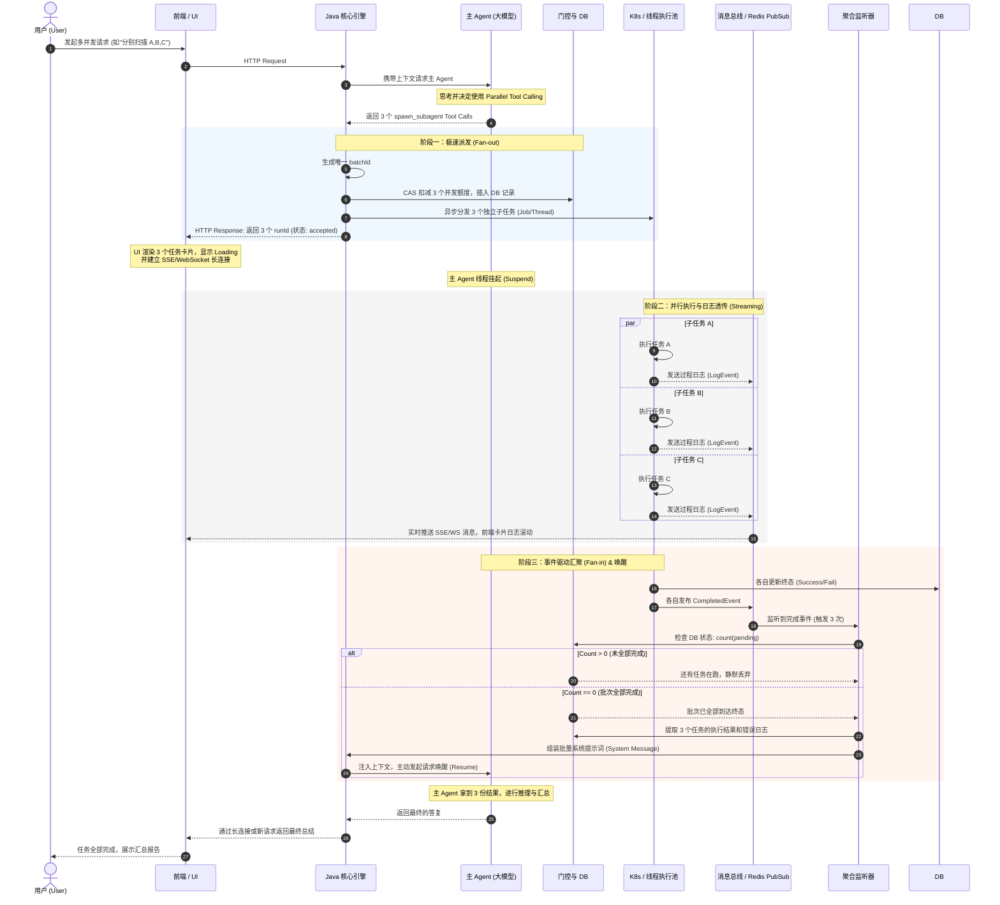

# Subagent 并行执行机制分析

本文档分析了 Claude Code / OpenClaw 项目中 Subagent 的并行执行机制，以及与本项目的对等实现。

## 核心结论

**Claude Code 没有自动任务拆分或 Fan-out 工具**。每次 `spawn` 调用只创建一个子 Agent，并行加速需要调用者主动多次调用 spawn 工具。

## Claude Code 的 spawn 机制

### 工具定义

```typescript
// src/tools/AgentTool/AgentTool.tsx
const baseInputSchema = z.object({
  description: z.string().describe('A short (3-5 word) description of the task'),
  prompt: z.string().describe('The task for the agent to perform'),
  subagent_type: z.string().optional().describe('The type of specialized agent to use'),
  run_in_background: z.boolean().optional()
    .describe('Set to true to run this agent in the background.')
});
```

### 异步执行流程

```typescript
// src/tools/AgentTool/AgentTool.tsx:567-750
const shouldRunAsync = (
  run_in_background === true || 
  selectedAgent.background === true || 
  isCoordinator || 
  forceAsync
) && !isBackgroundTasksDisabled;

if (shouldRunAsync) {
  // 1. 注册后台任务
  const agentBackgroundTask = registerAsyncAgent({
    agentId: asyncAgentId,
    description,
    prompt,
    selectedAgent,
  });

  // 2. 立即返回（不等待 agent 完成）
  return { data: { status: 'async_launched', agentId, ... } };
  
  // 3. Agent 在后台独立执行
  void runWithAgentContext(asyncAgentContext, () => 
    runAsyncAgentLifecycle({...})
  );
}
```

### 并行调用方式

**调用者需要显式循环调用**：

```typescript
// 方式 1: 顺序 spawn（每个立即返回，后台并行）
const files = ["a.txt", "b.txt", "c.txt"];
for (const file of files) {
  await callAgentTool({
    prompt: `Process ${file}`,
    run_in_background: true  // 关键：后台运行
  });
  // 立即返回 async_launched，agent 在后台执行
}

// 方式 2: Promise.all 并行 spawn
await Promise.all(
  files.map(file => callAgentTool({
    prompt: `Process ${file}`,
    run_in_background: true
  }))
);
```

### 关键设计点

| 设计点 | 说明 |
|--------|------|
| **立即返回** | `registerAsyncAgent` 后立即返回，不等待完成 |
| **独立 AbortController** | 后台 agent 使用独立的 controller，不被父任务取消影响 |
| **事件通知完成** | 完成后通过 `agent_ended` 事件推送通知给父 Agent |
| **进度追踪** | 通过 `updateAgentProgress` 更新后台任务进度 |
| **输出文件** | 结果写入临时文件，可通过 `outputFile` 路径读取 |

## OpenClaw 的 spawn 机制

### 工具定义

```typescript
// openclaw/src/agents/tools/sessions-spawn-tool.ts
const SessionsSpawnToolSchema = Type.Object({
  task: Type.String(),
  label: Type.Optional(Type.String()),
  runtime: optionalStringEnum(["subagent", "acp"]),
  agentId: Type.Optional(Type.String()),
  model: Type.Optional(Type.String()),
  runTimeoutSeconds: Type.Optional(Type.Number({ minimum: 0 })),
  thread: Type.Optional(Type.Boolean()),
  mode: optionalStringEnum(["run", "session"]),
  sandbox: optionalStringEnum(["inherit", "require"]),
  attachments: Type.Optional(Type.Array(...)),
});
```

### 执行流程

```typescript
// openclaw/src/agents/tools/sessions-spawn-tool.ts:287-320
const result = await spawnSubagentDirect(
  {
    task,
    label: label || undefined,
    agentId: requestedAgentId,
    model: modelOverride,
    runTimeoutSeconds,
    mode,
    cleanup,
    sandbox,
    expectsCompletionMessage: true,
    attachments,
  },
  { agentSessionKey, agentChannel, ... }
);

return jsonResult(result);  // 立即返回 { status: "accepted", runId, childSessionKey }
```

### 并发控制

```typescript
// openclaw/src/agents/subagent-registry.ts
export function countActiveRunsForSession(requesterSessionKey: string): number {
  return countActiveRunsForSessionFromRuns(subagentRuns, requesterSessionKey);
}

// 配置限制
const maxChildren = cfg.agents?.defaults?.subagents?.maxChildrenPerAgent ?? 5;
const activeChildren = countActiveRunsForSession(requesterInternalKey);
if (activeChildren >= maxChildren) {
  return { status: "forbidden", error: "max active children reached" };
}
```

## 本项目 (ai-agent-server) 的实现

### 工具定义

```java
// src/main/java/demo/k8s/agent/tools/local/planning/SpawnSubagentTool.java
public static final String SPAWN_SUBAGENT_INPUT_SCHEMA =
    "{" +
    "  \"type\": \"object\"," +
    "  \"properties\": {" +
    "    \"goal\": {\"type\": \"string\", \"description\": \"Clear, specific description\"}," +
    "    \"agentType\": {\"type\": \"string\", \"enum\": [\"general\", \"worker\", \"bash\", \"explore\", \"edit\", \"plan\"]}" +
    "  }," +
    "  \"required\": [\"goal\"]" +
    "}";
```

### 执行流程

```java
// src/main/java/demo/k8s/agent/tools/local/planning/SpawnSubagentTool.java:225-255
Set<String> allowed = spawnGatekeeper.globalSafeToolNames();
SpawnResult spawnResult = multiAgentFacade.getObject().spawnTask(
    "spawn_subagent_task",
    goal,
    agentType,
    0,  // currentDepth
    allowed);

if (!spawnResult.isSuccess()) {
    return spawnRejected(spawnResult.getMessage());
}

// 立即返回 runId
String runId = spawnResult.getRunId();
SubagentRun row = subagentRunService.getRun(runId, sessionId);
return spawnSuccess(runId, goal, row.getResult());
```

### 并发控制

```java
// src/main/java/demo/k8s/agent/subagent/SpawnGatekeeper.java:58-87
public MustDoNext checkAndAcquire(String sessionId, int currentDepth, Set<String> allowedTools) {
    // 1. 深度检查
    if (currentDepth >= props.getMaxSpawnDepth()) {
        return MustDoNext.simplify("Maximum spawn depth reached");
    }

    // 2. 工具白名单检查
    for (String tool : allowedTools) {
        if (!globalSafeTools.contains(tool)) {
            return MustDoNext.simplify("Tool not in allowed scope");
        }
    }

    // 3. 并发槽位原子占位 (CAS 操作)
    int max = props.getMaxConcurrentSpawns();
    AtomicInteger c = sessionConcurrentCounter.computeIfAbsent(sessionId, k -> new AtomicInteger(0));
    while (true) {
        int v = c.get();
        if (v >= max) {
            return MustDoNext.simplify("Too many concurrent subtasks");
        }
        if (c.compareAndSet(v, v + 1)) {
            return null;  // 检查全部通过
        }
    }
}
```

## 三者对比

| 特性 | Claude Code | OpenClaw | ai-agent-server |
|------|-------------|----------|-----------------|
| **spawn 语义** | 创建独立上下文 | 创建独立会话 | 创建独立运行 |
| **立即返回** | ✅ `async_launched` | ✅ `accepted` | ✅ `success` + runId |
| **后台执行** | ✅ 独立线程 | ✅ 独立进程/线程 | ✅ 独立执行器 |
| **并发限制** | ✅ `maxChildrenPerAgent` | ✅ `maxChildrenPerAgent` | ✅ `maxConcurrentSpawns` |
| **深度限制** | ✅ `maxSpawnDepth` | ✅ `maxSpawnDepth` | ✅ `maxSpawnDepth` |
| **超时控制** | ✅ `runTimeoutSeconds` | ✅ `runTimeoutSeconds` | ✅ `wallclockTtlSeconds` |
| **完成通知** | ✅ `agent_ended` 事件 | ✅ completion message | ✅ DB 状态更新 |
| **批量 spawn** | ❌ 需多次调用 | ❌ 需多次调用 | ❌ 需多次调用 |
| **Fan-out 工具** | ❌ 无 | ❌ 无 | ❌ 无（可实现） |

## 并行加速的正确使用方式

### 推荐模式

```typescript
// 父 Agent 主动循环调用 spawn
const tasks = [
  { file: "a.txt", op: "analyze" },
  { file: "b.txt", op: "analyze" },
  { file: "c.txt", op: "analyze" }
];

// 方式 1: 顺序 spawn，后台并行执行
for (const task of tasks) {
  const result = await callTool("spawn_subagent", {
    goal: `Analyze file: ${task.file}`
  });
  // 立即返回 runId，子 Agent 在后台运行
}

// 方式 2: Promise.all 并行 spawn
const runIds = await Promise.all(
  tasks.map(task => callTool("spawn_subagent", {
    goal: `Analyze file: ${task.file}`
  }).then(r => r.runId))
);
```

### 等待完成

```typescript
// 轮询等待（不推荐）
async function waitForCompletion(runId: string) {
  while (true) {
    const status = await callTool("get_run_status", { runId });
    if (status === "COMPLETED") break;
    await sleep(1000);
  }
}

// 事件通知（推荐）
// 子 Agent 完成后自动推送 completion message 给父 Agent
```

## 为什么不是自动拆分？

| 原因 | 说明 |
|------|------|
| **任务语义不明确** | "处理这 10 个文件" vs "写一个功能" — LLM 无法可靠判断何时该并行 |
| **责任分离** | 父 Agent 负责拆解和调度，子 Agent 负责执行具体任务 |
| **资源控制** | 避免意外 spawn 大量子 Agent 耗尽配额 |
| **上下文隔离** | 每个子 Agent 看不到其他子 Agent 的状态，需要父 Agent 协调 |

## 本项目独有优势

| 特性 | 说明 |
|------|------|
| **Shadow 模式** | 可评估 spawn 而不实际执行，用于门控策略和提示词测试 |
| **运维 API** | 7 个 `/api/ops/subagent/**` 接口监控子 Agent 状态 |
| **动态工具白名单** | 从 `ToolRegistry` 动态获取，新增工具无需修改门控 |
| **DB 持久化** | `subagent_run` 表全生命周期记录，支持重启恢复 |

## 可选改进方向

### 1. 批量派生 API

```java
// 可选：添加批量派生接口
POST /api/ops/subagent/batch-spawn
{
  "sessionId": "...",
  "tasks": [
    {"goal": "处理文件 1", "agentType": "worker"},
    {"goal": "处理文件 2", "agentType": "worker"},
    ...
  ]
}
```

### 2. 调整并发配置

```yaml
# application.yml
demo:
  multi-agent:
    max-concurrent-spawns: 10  # 默认 5 -> 10
    max-spawn-depth: 5         # 默认 3 -> 5
    wallclock-ttl-seconds: 600  # 默认 180 -> 600
```

### 3. Fan-out 工具

```java
// 可选：实现 Fan-out 工具
{
  "name": "spawn_subagent_batch",
  "description": "Spawn multiple subagents in parallel for fan-out execution",
  "input_schema": {
    "type": "object",
    "properties": {
      "tasks": {
        "type": "array",
        "items": {
          "type": "object",
          "properties": {
            "goal": {"type": "string"},
            "agentType": {"type": "string", "enum": ["worker", "bash", "explore"]}
          }
        },
        "maxItems": 10
      }
    }
  }
}
```

## 总结

1. **spawn 是"创建独立上下文"的原语，不是自动并行化器**
2. **并发加速需要父 Agent 主动多次调用 spawn**
3. **本项目的核心并行能力与 Claude Code / OpenClaw 对齐**
4. **Shadow 模式和运维 API 是额外优势**

## 参考资料

- [Claude Code AgentTool.tsx](../../src/tools/AgentTool/AgentTool.tsx)
- [OpenClaw sessions-spawn-tool.ts](../../openclaw/src/agents/tools/sessions-spawn-tool.ts)
- [OpenClaw subagent-spawn.ts](../../openclaw/src/agents/subagent-spawn.ts)
- [SpawnSubagentTool.java](../src/main/java/demo/k8s/agent/tools/local/planning/SpawnSubagentTool.java)
- [MultiAgentFacade.java](../src/main/java/demo/k8s/agent/subagent/MultiAgentFacade.java)
- [SpawnGatekeeper.java](../src/main/java/demo/k8s/agent/subagent/SpawnGatekeeper.java)


## 我的看法
为了将我们前面讨论的**「Map-Reduce 异步并发」**与**「前端执行流透传（缓解焦虑）」**完美结合，我们需要在原有的时序图中增加 **Frontend（前端 / UI）** 和 **SSE/WebSocket（长连接透传）** 的角色。

这是经过全面完善的**全链路生产级架构时序图**。它不仅描述了后端的调度逻辑，还完整呈现了用户侧的交互体验闭环。

### 核心阶段说明

1.  **意图解析与派发 (Fan-out)**：主 Agent 决定并发，后端拦截指令，瞬间将任务扔进执行池，并**立刻向前端返回任务已初始化的状态**，让前端 UI 发生变化（如展示三个 Loading 卡片）。
2.  **隔离执行与状态透传 (Streaming)**：子任务在独立的沙盒中运行，产生日志或进度时，通过消息总线**实时推送到前端**。这一步是缓解用户等待焦虑的核心。
3.  **事件驱动汇聚与唤醒 (Fan-in & Resume)**：后端聚合器静默监听，当全部子任务完成后，将结果打包注入主会话，唤醒主 Agent 做最终的总结。

---

### 完整全链路时序图 (Mermaid)



---

### 动态流转演示

为了更直观地理解这三个阶段中**“数据包”**和**“控制权”**是如何在微服务架构中流转的，我为你构建了一个架构数据流动态模拟器。你可以通过这个交互式组件，观察任务从前端发起、引擎扇出（Fan-out）、并行执行与日志回传，直到最后聚合扇入（Fan-in）唤醒主大模型的完整生命周期。

```json?chameleon
{"component":"LlmGeneratedComponent","props":{"height":"700px","prompt":"Create an interactive architecture data-flow simulator for an AI Agent System. \n\nObjective: Visualize the asynchronous 'Fan-out / Fan-in' Map-Reduce pattern with real-time UI updates.\n\nStrategy: Standard Layout. A network diagram representing the system architecture.\n\nNodes to include:\n1. 'Frontend (UI)'\n2. 'Main LLM'\n3. 'Dispatcher Engine'\n4. 'Task Pool' (container with 3 sub-nodes: Worker A, Worker B, Worker C)\n5. 'Event Bus'\n6. 'Fan-in Aggregator'\n\nInputs:\n- A 'Start Request' button to initiate the flow.\n- A 'Reset' button.\n\nBehavior:\n- Step 1 (Request): Highlight Frontend, animate a data packet to Dispatcher Engine, then to Main LLM.\n- Step 2 (Fan-out): Main LLM animates 3 simultaneous tool calls back to Dispatcher. Dispatcher immediately sends an 'Accepted' signal back to Frontend (indicating UI cards created), and simultaneously sends 3 distinct task packets to Worker A, B, and C.\n- Step 3 (Streaming): As Workers process, they periodically send small 'Log' packets to the Event Bus, which forwards them directly to the Frontend (visualizing real-time log streaming).\n- Step 4 (Fan-in): Workers finish at slightly different times. Upon finishing, each sends a 'Complete' packet to Event Bus -> Fan-in Aggregator. Aggregator displays a counter (1/3, 2/3, 3/3).\n- Step 5 (Wake-up): Only when counter reaches 3/3, the Aggregator sends one combined 'Results' packet to the Main LLM.\n- Step 6 (Final): Main LLM processes and sends final response packet back to Frontend.\n- Provide a text panel that dynamically updates to explain the current active step in the sequence.","id":"im_7577caf813fe4b40"}}
```